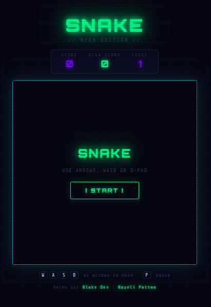

# 🐍 Snake Neon Edition

Un juego de Snake clásico con estética **neon retro** construido con HTML, CSS y JavaScript puro. Sin librerías externas, sin frameworks — solo código vanilla.

---

## 🎮 Demo

> **[🕹️ Jugar en vivo](https://nayelipaitan.github.io/snake-neon)**

---

## 📸 Vista previa



---

## ✨ Características

- 🎨 Estética neon retro con efectos de brillo (glow) y líneas de escaneo CRT
- 📱 **Responsive** — funciona en móvil y escritorio
- 🕹️ D-Pad táctil para móviles + soporte para swipe
- ⌨️ Control por teclado: flechas o WASD
- ⏸️ Sistema de pausa
- 🏆 Puntuación y récord guardado en el navegador (localStorage)
- ⚡ Sistema de niveles — la serpiente se acelera conforme subes de nivel
- 🔊 Sin dependencias externas

---

## 🗂️ Estructura del proyecto

```
snake-neon/
├── index.html     # Estructura HTML de la página
├── style.css      # Estilos visuales (tema neon)
├── script.js      # Lógica del juego
├── img
|    └── icon.ico       # Ícono de la pestaña
└── README.md      # Este archivo
```

---

## 🚀 Cómo ejecutarlo

### Abrir directo en el navegador
1. Descarga o clona el repositorio
2. Abre `index.html` en tu navegador

### Opción 2 — GitHub Pages
1. El juego estará disponible en `https://nayelipaitan.github.io/snake-game/`

---

## 🎯 Cómo jugar

| Acción | Teclado | Móvil |
|--------|---------|-------|
| Mover | Flechas o `W A S D` | D-Pad o swipe |
| Pausar | `P` | Botón ⏸ del D-Pad |
| Iniciar / Reiniciar | Clic en `[ START ]` | Tap en `[ START ]` |

### Reglas
- Come la comida 🔴 para crecer y sumar puntos
- Cada comida vale **10 × nivel** puntos
- Cada **50 puntos** subes de nivel y la velocidad aumenta
- El juego termina si chocas con una pared o con tu propio cuerpo
- El récord se guarda automáticamente en el navegador

---

## 🛠️ Tecnologías usadas

| Tecnología | Uso |
|------------|-----|
| HTML5 | Estructura de la página y elemento `<canvas>` |
| CSS3 | Diseño visual, animaciones y responsive |
| JavaScript (ES6+) | Lógica del juego, eventos y Canvas API |
| Canvas API | Renderizado del tablero y los sprites |
| localStorage | Guardado del récord entre sesiones |
| Google Fonts | Tipografías *Orbitron* y *Share Tech Mono* |

---

## 📐 Cómo funciona (resumen técnico)

### El bucle del juego
El juego corre con `setInterval` que llama a la función `step()` cada X milisegundos. Con cada paso:
1. Calcula la nueva posición de la cabeza
2. Verifica colisiones (pared y cuerpo)
3. Si comió: suma puntos y coloca nueva comida
4. Si no: elimina el último segmento (efecto de movimiento)
5. Redibuja todo el canvas

### Sistema de niveles
```
Velocidad inicial: 120ms por paso
Velocidad mínima:   55ms por paso
Fórmula: velocidad = max(55, 120 - (nivel - 1) × 10)
```

### Responsive
El canvas se redimensiona dinámicamente con `min(400px, 90vw)`, siempre cuadrado. En móvil (`< 600px`) aparece el D-Pad y se ocultan los hints de teclado.

---

## 👥 Autores

| Nombre | Rol |
|--------|-----|
| **Blake Dev** | Desarrollo |
| **Nayeli Paitan** | Desarrollo |

---

## 📄 Licencia

Este proyecto es de uso libre para fines educativos y personales.
